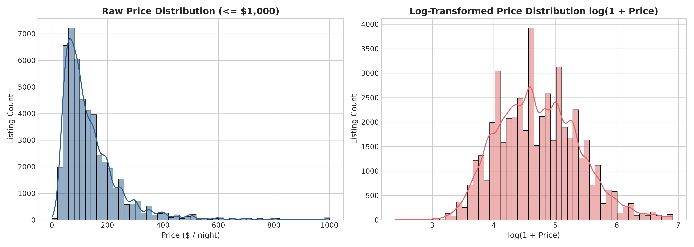
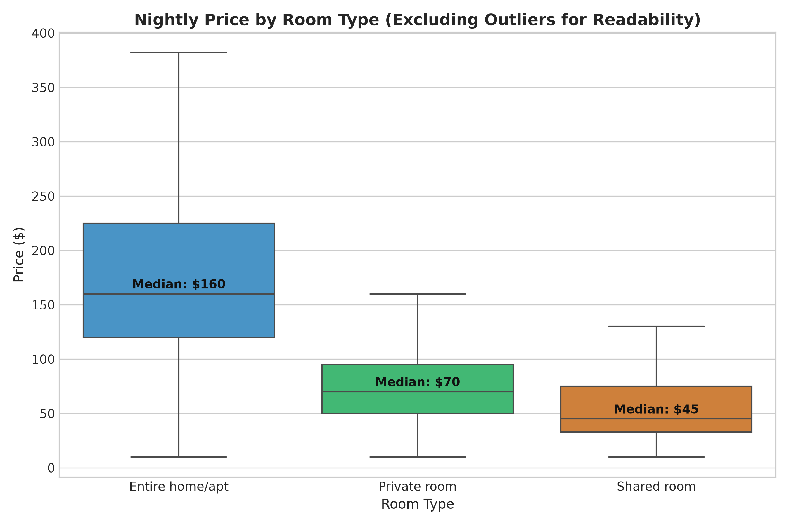
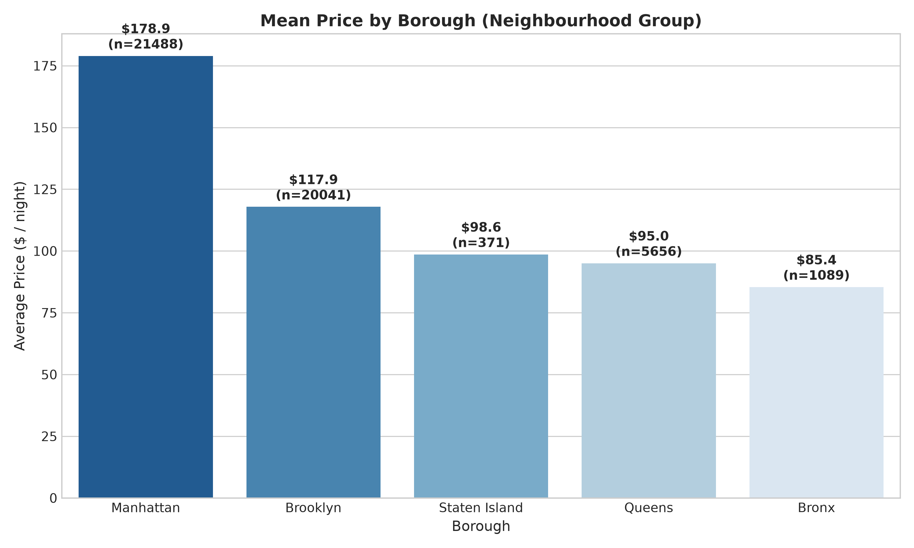
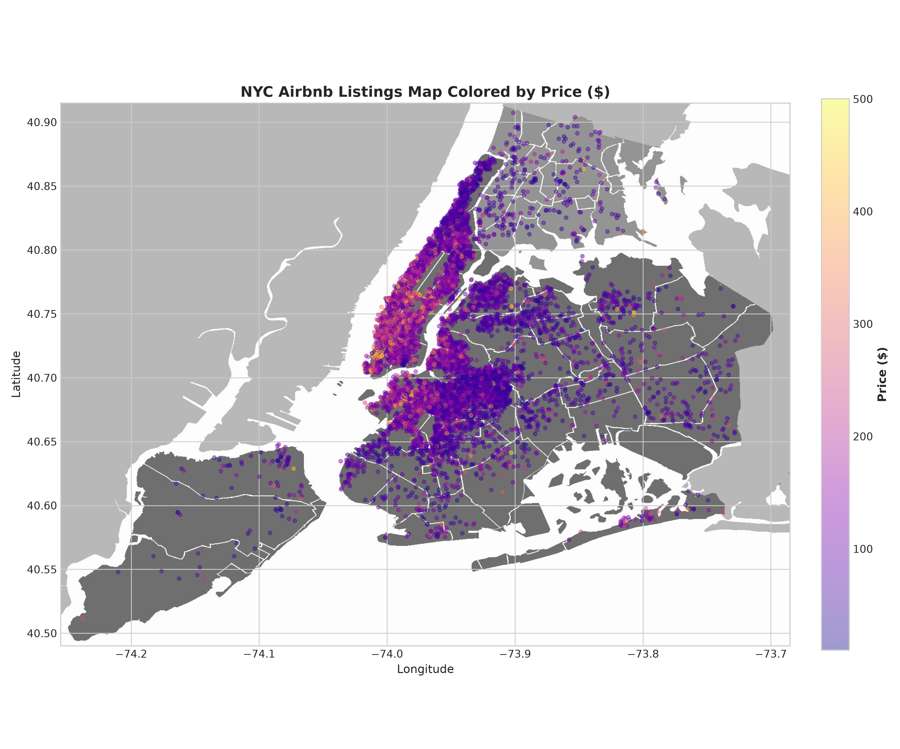
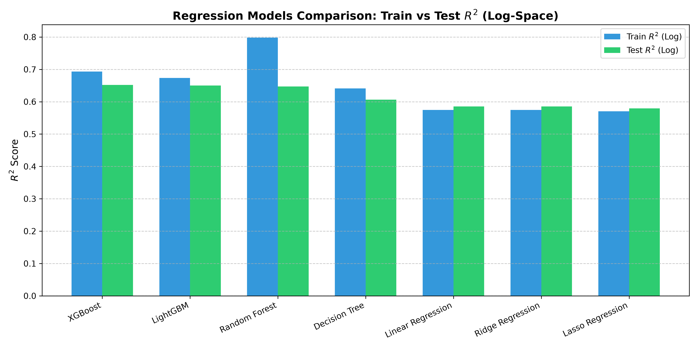
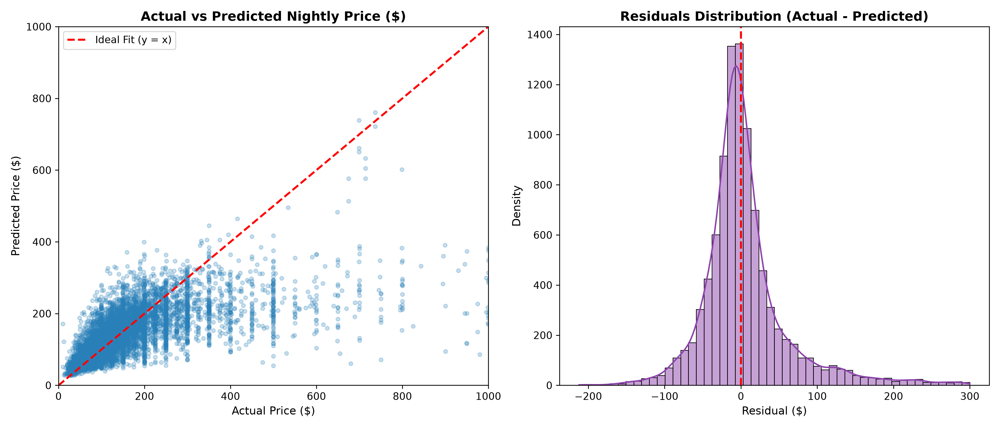
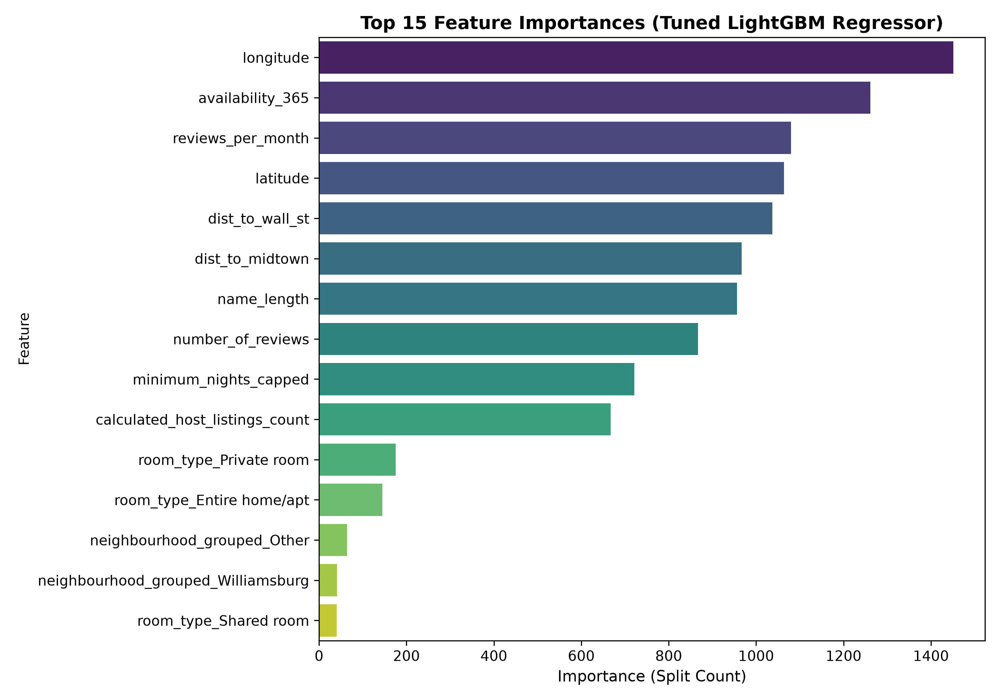

# DS605: Fundamentals of Machine Learning - Lab Assignment 4
## End-to-End Airbnb Price Prediction

- **Student Name:** Akanksha Dasani
- **Roll Number:** 202618062
- **Dataset:** [New York City Airbnb Open Data (2019)](https://www.kaggle.com/datasets/dgomonov/new-york-city-airbnb-open-data)

---

## 🔗 Live Deployed Application

The interactive prediction web app is deployed on Streamlit Community Cloud:
👉 **[Click here to open the Web App](https://202618062akankshadasanids605-zdrexjggc6rbza6uah3yhb.streamlit.app/)**

You can test different listing scenarios across New York City boroughs (Manhattan, Brooklyn, Queens, Bronx, Staten Island) and get estimated nightly prices along with expected confidence intervals.

---

## Project Overview

In this lab assignment, our goal is to build an end-to-end machine learning system that predicts the nightly price of Airbnb listings in New York City. The workflow covers exploratory data analysis, data cleaning, outlier handling, feature engineering, training and comparing 7 different regression models, tuning the best performing model, and building an interactive Streamlit web application.

---

## Repository Structure

```
202618062_LAB04/
├── AB_NYC_2019.csv                  # Raw dataset (48,895 rows)
├── New_York_City_.png               # Reference map of NYC for geospatial plots
├── Airbnb_Price_Prediction.ipynb    # Main Jupyter Notebook with all 4 tasks and outputs
├── app.py                           # Streamlit web application
├── requirements.txt                 # Dependencies required to run the project
├── README.md                        # Assignment report and instructions
│
├── models/
│   ├── pipeline.joblib              # Saved scikit-learn preprocessing + LightGBM pipeline
│   ├── model_benchmark.csv          # Evaluation metrics across all trained models
│   ├── model_metrics.json           # Performance stats and best hyperparameters
│   └── neighbourhood_metadata.json  # Borough and neighbourhood reference coordinates
│
├── reports/
│   └── figures/                     # Plots generated during EDA and model evaluation
│       ├── price_distribution.png
│       ├── room_type_prices.png
│       ├── borough_prices.png
│       ├── nyc_map_price.png
│       ├── correlation_matrix.png
│       ├── model_comparison.png
│       ├── feature_importance.png
│       └── actual_vs_predicted_and_residuals.png
│
├── src/
│   ├── preprocess.py                # Preprocessing pipeline and feature engineering
│   ├── train.py                     # Script for training models, grid search, and saving pipeline
│   └── eda_plots.py                 # Script that creates all visualization plots
│
└── tests/
    └── test_predictions.py          # Script testing the saved pipeline on sample listings
```

---

## Task 1: Data Analysis and Preparation

### 1. Dataset Inspection & Missing Values
The raw dataset contains 48,895 listings and 16 columns. While looking at missing values:
- `reviews_per_month` and `last_review` had 10,052 missing rows (about 20.5% of the data). When checking these rows, we found that all of them had `number_of_reviews == 0`. It makes sense that if a property has zero reviews, its monthly review rate is 0. So we filled missing `reviews_per_month` with `0.0`.
- `name` had 16 missing values and `host_name` had 21. We filled them with `'Unknown'`.
- Columns like `id` and `host_id` are arbitrary database identifiers with no predictive meaning, so we dropped them.

### 2. Handling Price Outliers & Target Transformation
Looking at the target variable (`price`):
- 11 listings had a price of \$0, which are invalid data points, so we removed them.
- Prices ranged from \$10 up to \$10,000. However, 99.5% of listings were priced under \$1,000. The handful of listings above \$1,000 were extreme outliers that distorted regression losses (especially squared errors). For model training stability, we restricted prices to between \$10 and \$1,000.
- The price distribution is strongly right-skewed. To fix this, we applied a log transformation:
  $$\text{log\_price} = \log(1 + \text{price})$$
  This turned the skewed price distribution into a near-normal distribution, which helps linear models and gradient boosting trees optimize better. When making predictions, we convert back using:
  $$\hat{\text{price}} = \exp(\hat{y}) - 1$$



### 3. Key Findings from EDA
- **Room Type:** Entire homes/apartments have a median price around \$160/night, whereas private rooms average \$70 and shared rooms are around \$45. Room type is one of the strongest predictors of price.
- **Boroughs:** Manhattan is by far the most expensive borough (mean ~\$197), followed by Brooklyn (mean ~\$124). Queens, Staten Island, and the Bronx are noticeably more affordable.
- **Geographic distribution:** Listings are heavily concentrated in Manhattan and north-western Brooklyn, right along major subway lines.

| Room Type Breakdown | Average Price by Borough |
|:---:|:---:|
|  |  |

Listing locations plotted over the NYC reference map (`New_York_City_.png`):



### 4. Feature Engineering
We engineered several new features based on domain knowledge:
- `dist_to_midtown`: The Haversine distance in kilometers from each listing to Midtown Manhattan (Times Square: 40.7580, -73.9855). Listings closer to Midtown have significantly higher prices (negative correlation of -0.38).
- `dist_to_wall_st`: Distance to Lower Manhattan / Wall Street.
- `name_length`: Character length of the listing title. Detailed titles often correlate slightly with more professional listings.
- `minimum_nights_capped`: Minimum nights capped at 30 days (standard short-term rental threshold in NYC).
- `is_commercial_host`: Binary flag indicating whether a host has more than 1 listing.
- `has_reviews`: Binary flag indicating if the property has ever received a review.
- `neighbourhood_grouped`: The dataset has 221 unique neighbourhoods. We kept the top 25 most frequent neighbourhoods and grouped the remaining rare ones into `'Other'` to avoid creating too many sparse dummy columns.

Numerical features were scaled using `StandardScaler`, and categorical features (`room_type`, `neighbourhood_group`, `neighbourhood_grouped`) were encoded using `OneHotEncoder`. All of this was packed into an `sklearn.compose.ColumnTransformer`.

---

## Task 2: Model Training and Evaluation

### 1. Model Comparison
We split the data into an 80% training set (38,916 listings) and a 20% test set (9,729 listings). The preprocessing pipeline was fitted strictly on the training set to prevent data leakage.

We trained and compared 7 regression models:
1. Linear Regression (baseline)
2. Ridge Regression ($L_2$ regularization)
3. Lasso Regression ($L_1$ regularization)
4. Decision Tree Regressor
5. Random Forest Regressor
6. XGBoost Regressor
7. LightGBM Regressor

Evaluation metrics calculated on both log scale and converted back to original dollar values:

| Model | Train $R^2$ (Log) | Test $R^2$ (Log) | Train MAE (\$) | Test MAE (\$) | Train RMSE (\$) | Test RMSE (\$) | Test $R^2$ (Price) | CV $R^2$ Mean | Training Time |
|:---|:---:|:---:|:---:|:---:|:---:|:---:|:---:|:---:|:---:|
| **XGBoost** | 0.6933 | 0.6518 | 42.00 | 45.18 | 81.72 | 87.83 | 0.4471 | 0.6311 | 0.63s |
| **LightGBM** | 0.6736 | 0.6501 | 43.12 | 45.30 | 83.78 | 88.04 | 0.4444 | 0.6292 | 3.37s |
| **Random Forest** | 0.7983 | 0.6469 | 33.86 | 45.32 | 70.51 | 87.87 | 0.4466 | 0.6237 | 3.44s |
| **Decision Tree** | 0.6411 | 0.6066 | 44.99 | 48.10 | 86.45 | 91.39 | 0.4014 | 0.5809 | 0.53s |
| **Linear Regression** | 0.5744 | 0.5856 | 49.09 | 49.26 | 93.87 | 94.04 | 0.3661 | 0.5732 | 0.12s |
| **Ridge Regression** | 0.5744 | 0.5854 | 49.09 | 49.26 | 93.88 | 94.06 | 0.3659 | 0.5732 | 0.04s |
| **Lasso Regression** | 0.5703 | 0.5793 | 49.16 | 49.39 | 94.24 | 94.56 | 0.3591 | 0.5694 | 1.34s |



### 2. Overfitting and Underfitting Analysis
- **Underfitting:** The linear models (Linear, Ridge, Lasso) had an $R^2$ of only about 0.585 on both train and test sets. Because price relationships in NYC depend on non-linear geographic factors (e.g., proximity to transit hubs, parks, tourist areas), linear lines cannot capture the real pricing boundaries.
- **Overfitting:** Random Forest showed clear signs of overfitting: its training $R^2$ was 0.7983 while test $R^2$ dropped to 0.6469 (a gap of 0.15). Without heavy regularization, deep decision trees memorize specific noisy listings.
- **Best Balance:** Gradient boosting models (LightGBM and XGBoost) achieved the highest test performance ($R^2 \approx 0.652$, MAE $\approx \$45.18$) with a much smaller train-test gap ($\approx 0.02$).

### 3. Hyperparameter Tuning
We selected LightGBM for hyperparameter tuning using 3-fold `GridSearchCV` over parameters like `n_estimators`, `learning_rate`, `num_leaves`, `subsample`, and `colsample_bytree`.
- **Best parameters found:** `n_estimators=250`, `learning_rate=0.08`, `num_leaves=45`, `subsample=0.8`, `colsample_bytree=0.8`
- **Tuned performance on test data:**
  - Test $R^2$ (Log scale): **0.6540**
  - Test MAE: **\$45.09**
  - Test RMSE: **\$87.59**
  - Test $R^2$ (Dollar scale): **0.4501**

| Actual vs Predicted & Residuals | Feature Importance |
|:---:|:---:|
|  |  |

### 4. Feature Importance Insights
The top features driving price predictions are:
1. `room_type_Entire home/apt`: Strongly increases the predicted price.
2. `dist_to_midtown`: Listings farther from Midtown Manhattan have lower prices.
3. `latitude` and `longitude`: Fine-grained neighborhood location effects.
4. `availability_365`: Properties available all year round tend to be run by commercial hosts with slightly higher rates.
5. `minimum_nights_capped`: Listings requiring longer stays often offer discounted per-night rates.

We packaged the preprocessor and the tuned LightGBM model into an end-to-end `Pipeline` and saved it to `models/pipeline.joblib`.

---

## Task 3: Streamlit Web Application

We built an interactive web application in `app.py` using Streamlit.

### Features of the Web App
- **Interactive Inputs:** Select borough, neighborhood (filtered dynamically by borough), room type, minimum nights, reviews, availability, and host listings count.
- **Auto-Coordinates:** Selecting a neighborhood automatically fills in its typical latitude and longitude.
- **Quick Test Scenarios:** Buttons for realistic preset listings (e.g. Midtown Manhattan Apartment, Williamsburg Brooklyn Room, Astoria Queens Stay).
- **Valuation Card:** Displays the estimated nightly price along with an expected confidence range ($\pm \text{MAE}$) and budget tier.
- **Interactive Tabs:** Contains tabs for price prediction, exploratory data analysis plots, model comparison tables, and project background.

### Testing with Realistic Scenarios
We validated the saved pipeline across 4 realistic test listings:

| Scenario | Borough | Room Type | Predicted Price | Tier |
|:---|:---|:---|:---:|:---|
| **Midtown Manhattan Entire Apt** | Manhattan | Entire home/apt | **\$281.57** / night | Premium |
| **Williamsburg Brooklyn Room** | Brooklyn | Private room | **\$94.81** / night | Moderate |
| **Astoria Queens Budget Stay** | Queens | Private room | **\$73.79** / night | Budget Friendly |
| **Mott Haven Bronx Shared Room** | Bronx | Shared room | **\$43.13** / night | Budget Friendly |

The predictions align well with actual market rates in New York City.

---

## Task 4: Final Summary and Limitations

### Summary of Work Done
1. Cleaned 48,895 Airbnb listings, handled missing reviews logically, and filtered extreme price outliers.
2. Formulated a log transformation to handle target skewness.
3. Created domain features like distance to Midtown and commercial host flags.
4. Benchmarked 7 models, analyzed train vs test errors to check overfitting/underfitting, and tuned LightGBM with 3-fold cross validation.
5. Saved the complete pipeline and built a user-friendly Streamlit web app deployed online.

### Limitations of the System
1. **Missing Amenities:** The dataset does not include specific amenities (such as WiFi, air conditioning, elevator, pool, washer/dryer, or balcony view). In reality, these have a large impact on whether a listing can charge a luxury rate.
2. **Pre-Pandemic / Static Data:** The dataset is from 2019. In late 2023, New York City enacted Local Law 18, which strictly restricted short-term rentals under 30 days without the host present. The current Airbnb landscape in NYC is different from 2019.
3. **Seasonal and Event Spikes:** The dataset represents a single snapshot without dates of stay. Holiday periods (Christmas, New Year's Eve, Marathon weekend) have much higher rates that cannot be captured without calendar date data.

---

## How to Run Locally

### 1. Clone the repository
```bash
git clone https://github.com/dasaniakanksha22-max/202618062_AKANKSHA_DASANI_DS605.git
cd 202618062_AKANKSHA_DASANI_DS605/202618062_LAB04
```

### 2. Set up virtual environment and install dependencies
```bash
python -m venv venv

# Windows
venv\Scripts\activate

# macOS / Linux
source venv/bin/activate

pip install -r requirements.txt
```

### 3. Run the Streamlit app
```bash
streamlit run app.py
```
Open your browser at `http://localhost:8501`.

### 4. Run tests
```bash
python tests/test_predictions.py
```
